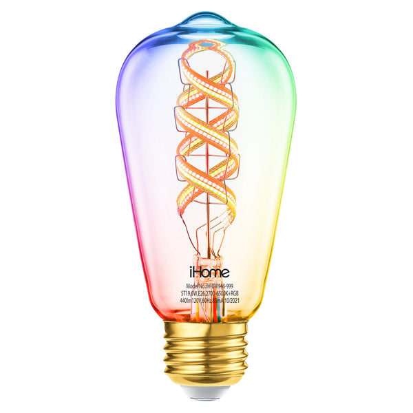
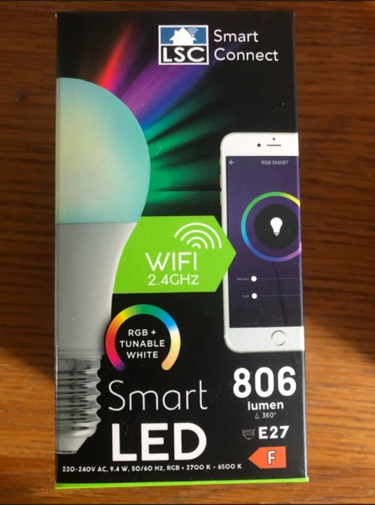
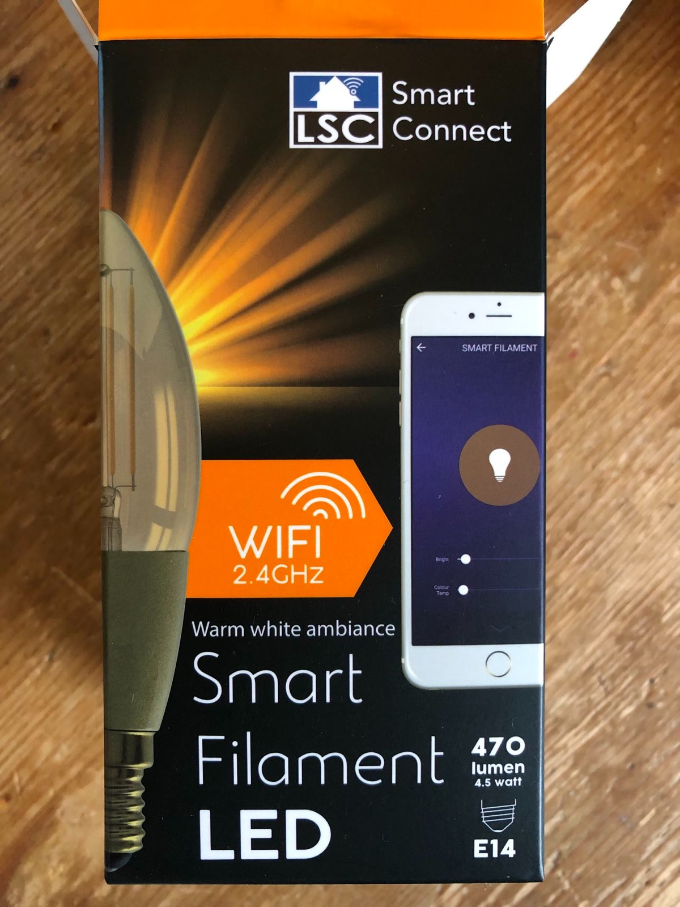
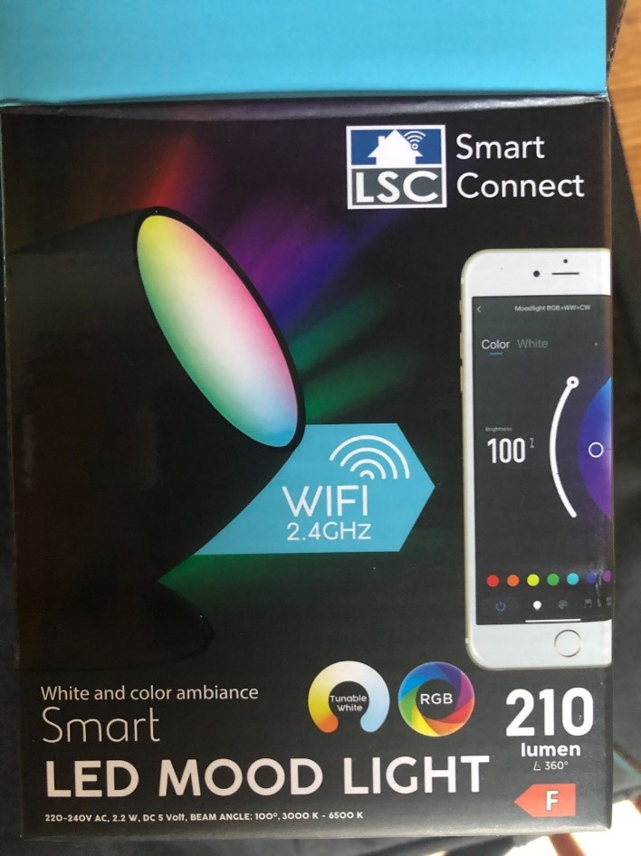
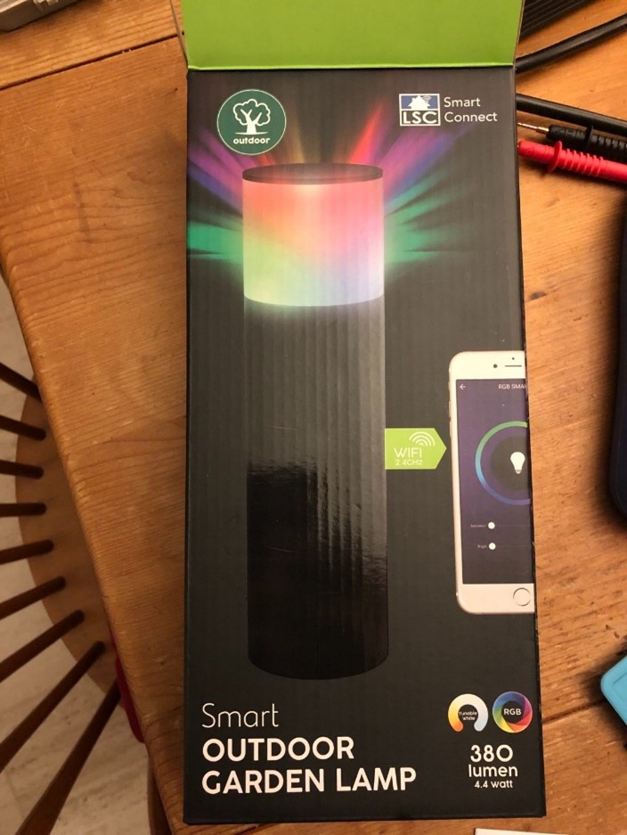
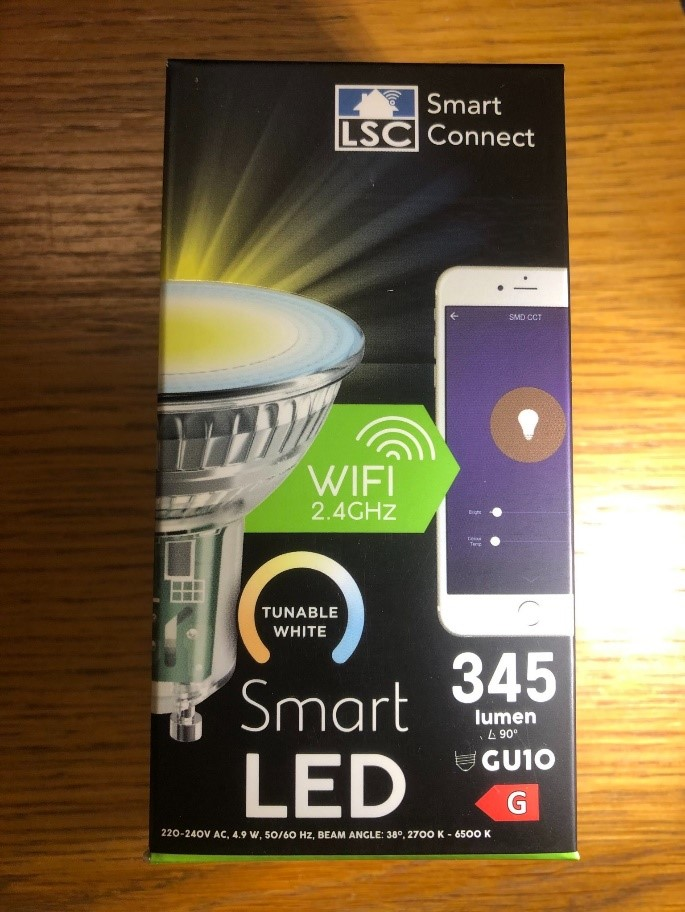
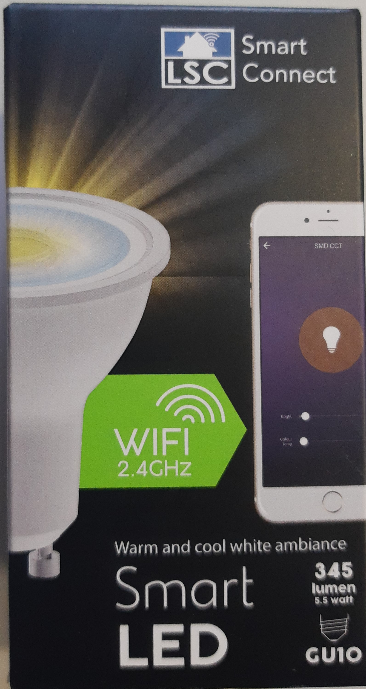
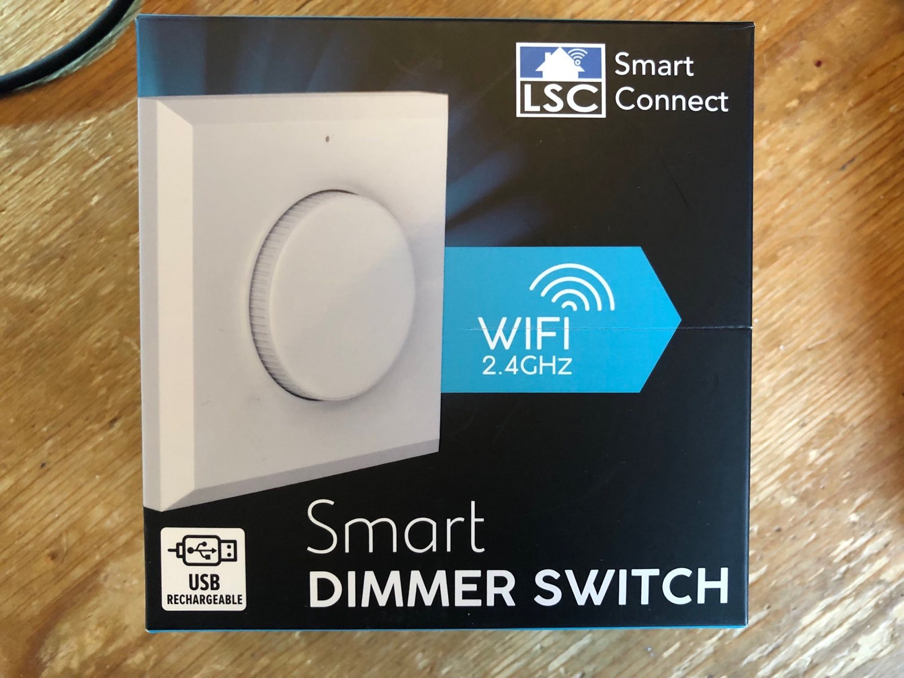

# Supported devices
| Brand | Picture | Device description | Article numbers | Flash dump / firmware acquired? | Exploitable? |
|:---:|:---:|:---:|:---:|:---:|:---:|
| iHome |  | iHome Spectra Smart Spiral ST19/E26 Edison Multicolor | IH-BW948-999 | Yes | Yes |
|  |  | iHome Spectra Smart Spiral G25 Edison Multicolor | IH-BW949-999 | Yes | Yes |
| LSC |  | Smart LED RGB + Tunable White E27 806 Lumen | 2578539 970724 | Yes | Yes |
|  |  |  | 2578539 970719.1 v1.0 | Yes | Yes |
|  |  | Smart LED Tunable White E27 806 Lumen | 3000272 970716 | Yes | Yes |
|  |  |  | 3000272 970715.1 v1.1 | Yes | Yes |
|  |  | Smart LED Tunable White E27 1400 Lumen | 3000273 970717 | Yes | Yes |
|  |  | Smart Filament Warm White E27 806 Lumen | 3001686 970709 | Yes | Yes |
|  |  | Smart Filament Warm White Ambiance E14 470 Lumen | 3001702 970727 | Yes | Yes |
|  |  | Smart LED Mood Light White and Color Ambiance 210 Lumen | 3004154 970743 | Yes | Yes |
|  |  |  | 3004154 970742 | Yes | Yes |
|  |  | WiFi Smart Outdoor Garden Lamp | 3005364 970796 v1.0 | Yes | Yes |
|  |  | Smart LED RGB + Tunable White GU10 380 Lumen | 3004919 970710 | Yes | Yes |
|  |  | Smart LED Tunable White GU10 345 Lumen | 3000267 970700 | Yes | Yes |
|  |  | Smart LED Downlight Tunable White 360 Lumen | 3006767 970820 | Yes | Yes |

# Support verification TBD
| Brand | Picture | Device description | Article number | Flash dump / firmware acquired? | Exploitable? |
|:---:|:---:|:---:|:---:|:---:|:---:|
| LSC |  | Smart LED Warm and Cool White Ambiance GU10 345 Lumen | 3000267 970703.1 v1.1 | In progress | Unknown |
|  |  | Smart Filament Warm White Ambiance E27 806 Lumen | 3001700 970739 | Yes | Unknown |
|  |  | WiFi Outdoor Dual Socket | 3004200 05/21 | Yes | Unknown |
|  |  | Smart Filament Extra Warm White Ambiance E27 350 Lumen | 3007257 970729 | Yes | Unknown |

# Unsupported devices
| Brand | Picture | Device description | Article number | Flash dump / firmware acquired? | Exploitable? |
|:---:|:---:|:---:|:---:|:---:|:---:|
| LSC |  | Smart Dimmer Switch | 3006033 970806 | Yes | No |
|  |  | Smart Siren | 970772 v2.0 | No - not a BK7231 chip | Unknown - verification needed |
